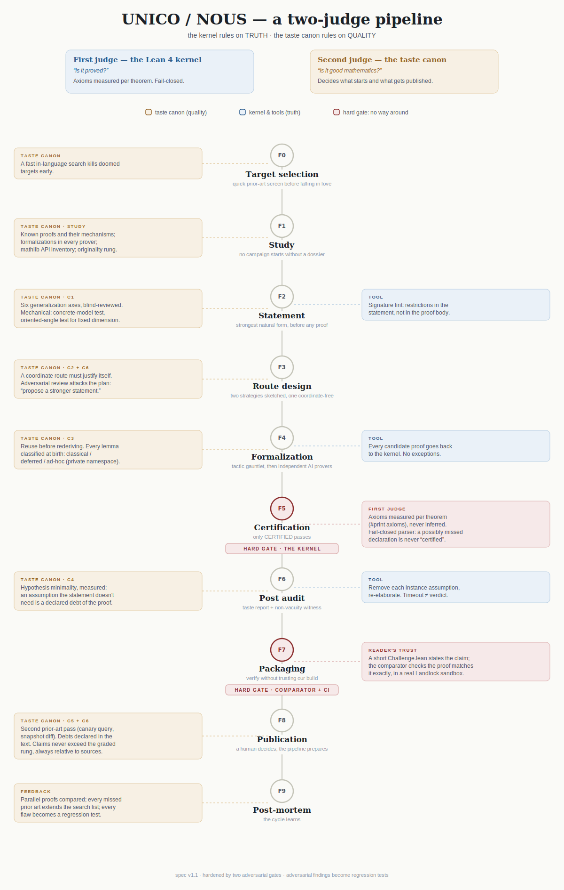

<div align="right">🌐 <a href="README.md">English</a> · <b>Italiano</b></div>

# unico-lean-proofs

[](https://github.com/Solarys431/unico-lean-proofs/actions/workflows/build.yml)
[](https://leanprover.github.io/)
[](https://github.com/leanprover-community/mathlib4)
[](LICENSE)

**Dimostrazioni Lean 4 verificate dalla macchina, prodotte dalla pipeline
autonoma di certificazione UNICO / NOUS** — selezione degli enunciati →
falsificazione numerica → ricerca della dimostrazione con più motori →
certificazione del kernel in locale → ri-verifica pubblica in CI.
A cura di [Solarys431](https://github.com/Solarys431).

Ogni file compila con Lean 4 e non contiene alcun `sorry`. Il livello di
fiducia è dichiarato file per file — **kernel puro** (nulla oltre gli assiomi
di mathlib) oppure **compilatore** (`native_decide`, che aggiunge la fiducia
in `Lean.ofReduceBool` e nel compilatore) — perché l'onestà sulla base fidata
conta più di una lista più lunga di spunte verdi.

**Come lavora la pipeline** — l'architettura, il *canone del gusto* (un secondo
giudice che valuta la qualità matematica, non solo la verità), i gate
avversariali, e come verificare le nostre affermazioni senza fidarsi del nostro
build: **[PIPELINE.md](PIPELINE.md)** (in inglese).

<a href="PIPELINE.md">
<picture>
  <source media="(prefers-color-scheme: dark)" srcset="assets/pipeline-schema-dark.svg">
  
</picture>
</a>

---

## In evidenza — La classificazione dei solidi platonici (Wiedijk #50)

*Il teorema che chiude gli Elementi di Euclide (XIII.18 e scolio), dimostrato
il 17 luglio 2026 dalla pipeline di certificazione autonoma UNICO / NOUS.*

> Un politopo convesso tridimensionale con faccette p-gonali regolari e tutti
> i vertici q-ciclici soddisfa q(p−2) < 2p; dunque (p, q) è uno dei cinque
> tipi platonici: (3,3), (4,3), (3,4), (5,3), (3,5).

```lean
theorem cyclicallyRegular_schlafli (P : FiniteConvexPolytope A) {p q : ℕ}
    (h : P.IsCyclicallyRegularOfType p q) :
    q * (p - 2) < 2 * p ∧
    ((p = 3 ∧ q = 3) ∨ (p = 4 ∧ q = 3) ∨ (p = 3 ∧ q = 4) ∨
     (p = 5 ∧ q = 3) ∨ (p = 3 ∧ q = 5))

theorem tetraedro_cyclicallyRegular :
    tetraedro.IsCyclicallyRegularOfType 3 3
```

L'enunciato vive su uno **spazio reale con prodotto interno astratto**: la
regolarità delle faccette è definita *per orbita* (un'isometria affine genera
ciclicamente i p vertici), senza mai postulare un angolo o una lunghezza; il
fan del vertice è pura struttura di incidenza. La disuguaglianza angolare è
il **teorema**, mai un'ipotesi. Il testimone (`tetraedro_cyclicallyRegular`)
mostra che il predicato non è vacuo. Perimetro, detto con precisione: questa
è la *classificazione locale dei tipi di Schläfli* (necessità delle cinque
coppie, più un testimone di esistenza) — non l'enumerazione dei cinque
solidi, che è la fase successiva dichiarata.

La dimostrazione costruisce una piccola teoria dei politopi convessi che
mathlib oggi non possiede (restrizione delle facce esposte, facce argmax
degli hull finiti, orbite traslate, la dicotomia rotazione/riflessione nel
piano, un lemma di argmax del coseno che doma i poligoni stellati con gli
inversi modulari) — 25 moduli, 158 teoremi kernel-puri, assiomi soltanto
`propext`, `Classical.choice`, `Quot.sound`.

Anteriorità, verificata lo stesso giorno: il teorema geometrico esiste in
**HOL Light** (Harrison); in Lean abbiamo trovato solo versioni numerologiche
(coppie di Schläfli come naturali, con la disuguaglianza postulata). Un
problema affine ma **più forte**, il `platonicCount` dimensione per dimensione
(`p_3 = 5`, `p_4 = 6`, `p_d = 3` per `d ≥ 5`, con flag-transitività e
similitudine), è posto sulla
[leaderboard lean-eval](https://leanprover.github.io/lean-eval-leaderboard/);
il nostro risultato **non** lo rivendica (è la nostra fase successiva
dichiarata), e quella leaderboard è a sottomissione, quindi il suo stato
riflette le soluzioni inviate, non una valutazione di ogni modello. Se conosci
lavori geometrici precedenti su questo teorema in Lean, apri pure una issue e
li citeremo con evidenza.

**Aggiornamento (18 luglio 2026): tutti e cinque i testimoni e la caratterizzazione completa.**
La classificazione delimita i tipi possibili; adesso è certificata anche la
direzione inversa: testimoni kernel-puri per tutti e cinque i tipi platonici
(tetraedro (3,3), cubo (4,3), ottaedro (3,4), dodecaedro (5,3) con la rotazione
aurea del pentagono, icosaedro (3,5)) e il teorema di caratterizzazione
`realizzabile_iff`: un tipo (p,q) è realizzabile **se e solo se** è una delle
cinque coppie platoniche; nessuna direzione è vacua. Il motore dei cinque
testimoni è il modulo di trasferimento
([`Trasferimento.lean`](UnicoProofs/Platonici/Trasferimento.lean)): faccette
regolari e fan ciclici si trasportano lungo le isometrie che preservano il
politopo, quindi per ogni solido bastano una faccetta e un fan costruiti a
mano; il resto lo fa la simmetria.

**Aggiornamento (18 luglio 2026, seconda release): il lower bound 3D sulle
definizioni del benchmark lean-eval.** Il benchmark enuncia la classificazione
platonica su definizioni proprie (bandiere, `IsRegular` come flag-transitività,
`platonicCount` come classi di similitudine). Le riproduciamo parola per parola
([`Benchmark.lean`](UnicoProofs/Platonici/Benchmark.lean)) e certifichiamo, su
quel contratto esatto, `cinque_le_platonicCount3 : 5 ≤ platonicCount 3`, con la
flag-transitività dei cinque solidi, l'invariante di similitudine (cardinalità
dei vertici) e il conteggio delle classi. È il **solo lower bound**: non risolve
il problema del benchmark, che chiede l'uguaglianza e i conteggi in ogni
dimensione; l'upper bound è la prossima fase del progetto.

Moduli: [`UnicoProofs/Platonici/`](UnicoProofs/Platonici/) — teoremi apicali in
[`Classificazione.lean`](UnicoProofs/Platonici/Classificazione.lean),
[`Realizzabilita.lean`](UnicoProofs/Platonici/Realizzabilita.lean),
[`RegolariBenchmark.lean`](UnicoProofs/Platonici/RegolariBenchmark.lean), i cinque
moduli testimone, e
[`TetraedroStadio2.lean`](UnicoProofs/Platonici/TetraedroStadio2.lean).

## In evidenza — Il teorema di Sylvester–Gallai

*Dimostrato il 14 luglio 2026 dalla pipeline di certificazione autonoma
UNICO / NOUS, in una sessione serale di novanta minuti.*

> Un insieme finito di punti del piano, non tutti su una stessa retta, ammette
> sempre una *retta ordinaria*: una retta che passa per esattamente due dei
> punti. — congetturato da J. J. Sylvester (1893), dimostrato da T. Gallai (1944)

```lean
theorem sylvester_gallai (S : Set P) (hfin : S.Finite) (hncol : ¬ Collinear ℝ S) :
    ∃ a ∈ S, ∃ b ∈ S, IsOrdinaryLine S a b
```

L'enunciato vale in ogni spazio reale con prodotto interno, col suo torsore
affine, **senza alcuna ipotesi di dimensione**. La dimostrazione è quella di
Kelly (1948), resa puramente vettoriale: niente aree, niente angoli, niente
triangoli simili; solo il prodotto interno. La disuguaglianza stretta che regge
l'argomento della distanza minima esce da un calcolo di una riga
(`⟪A, w⟫ = ‖A‖² > 0`: il punto minimizzante non è il piede della
perpendicolare), e il principio dei cassetti è isolato in un lemma su tre
numeri **reali** distinti; è esattamente lì che la dimostrazione deve usare
l'ordine di ℝ, perché il teorema è **falso su ℂ** (configurazione di Hesse).
Un testimone di soddisfacibilità (un triangolo concreto non allineato)
accompagna lo sviluppo: il teorema non è vero per vacuità.

**Prior art e novità.** Al momento della pubblicazione il teorema non è in
mathlib, e il capitolo 11 del [progetto Formal Book](https://github.com/mo271/FormalBook)
(«Lines in the plane») è un TODO aperto. Esiste uno sviluppo in Lean 3
([Happyves/Master_Thesis](https://github.com/Happyves/Master_Thesis), con un
`sorry`). In Lean 4, il repository [misc-yd di Yaël Dillies](https://github.com/YaelDillies/misc-yd)
dimostra il **teorema di Sylvester–Chvátal** (la generalizzazione di Chen, 2006,
agli spazi metrici finiti, con rette definite per chiusura di interposizione);
il suo corollario euclideo — l'enunciato classico dimostrato qui — vi è
abbozzato in un blocco commentato contenente un `sorry`. Per quanto ne
sappiamo, l'enunciato euclideo classico non era mai stato formalizzato in
Lean 4; non rivendichiamo alcuna priorità oltre la data del commit.

**Fiducia: kernel puro** — 0 `sorry`, 0 assiomi custom; tutte le dichiarazioni
di [`UnicoProofs/SylvesterGallai.lean`](UnicoProofs/SylvesterGallai.lean)
dipendono soltanto da `[propext, Classical.choice, Quot.sound]`. Verifica con
`lake build`.

---

## In evidenza — Teorema di Feuerbach (Wiedijk #29)

*L'enunciato classico, completo, dimostrato il 13 luglio 2026 dalla pipeline
autonoma di certificazione UNICO / NOUS — in una sola serata di lavoro.*

> In ogni triangolo, la circonferenza dei nove punti è tangente internamente al
> cerchio inscritto e tangente esternamente a ciascuno dei tre cerchi
> exinscritti. — K. W. Feuerbach, 1822

```lean
theorem feuerbach_insphere (t : Triangle ℝ P) :
    t.insphere.IsIntTangent t.ninePointCircle

theorem feuerbach_exsphere (t : Triangle ℝ P) (i : Fin 3) :
    (t.exsphere {i}).IsExtTangent t.ninePointCircle
```

Entrambi gli enunciati valgono per **ogni** triangolo di un torsore euclideo
reale di dimensione due, **senza condizioni aggiuntive**: l'esistenza dei
centri e la positività dei raggi sono derivate internamente da mathlib. La
tangenza è quella di mathlib (`Sphere.IsIntTangent` / `Sphere.IsExtTangent`;
per convenzione esplicita di mathlib i cerchi coincidenti contano come tangenti
internamente — rilevante solo per il triangolo equilatero, dove i due cerchi
coincidono).

**Prior art e novità.** Il teorema di Feuerbach è il #29 della
[lista di Freek Wiedijk](https://www.cs.ru.nl/~freek/100/). Era stato
formalizzato in **HOL Light** (John Harrison, basi di Gröbner), **Rocq** (team
CertiGeo, certificati riflessivi esterni) e **Isabelle/HOL** (Lawrence C.
Paulson, maggio 2026 — una traduzione assistita da AI della prova HOL Light).
La dimostrazione qui presentata è indipendente da tutte e tre: si normalizza il cerchio in/exinscritto al cerchio
unitario, dove i punti di tangenza `t₁ t₂ t₃` parametrizzano tutto; il centro
dei nove punti acquista la forma chiusa `e₂²/P` con
`P = (t₁+t₂)(t₁+t₃)(t₂+t₃)`; e il ramo (tangenza interna o esterna) è
inchiodato da un **certificato baricentrico dei segni**: con `W` il parametro
reale del modello e `λᵢ` i pesi baricentrici del centro,

```
W · λ₀λ₁λ₂ · ‖t₀−t₁‖²‖t₀−t₂‖²‖t₁−t₂‖² = −1     e     W · (‖t₀+t₁+t₂‖² − 1) = 1
```

— due identità razionali certificate da `linear_combination` con cofattori
generati da sympy. I segni degli `excenterWeights` di mathlib (tutti positivi
per l'incentro, esattamente uno negativo per un excentro) decidono il ramo:
`W ≤ −1` dà la tangenza interna, `W > 1/8` quella esterna. Niente archi,
niente analisi per casi sugli angoli.

**Fiducia: kernel puro** — 0 `sorry`, 0 assiomi propri negli 11 moduli
([`UnicoProofs/Feuerbach/`](UnicoProofs/Feuerbach/)); i due teoremi dipendono
solo da `[propext, Classical.choice, Quot.sound]`. Verifica con `lake build`.

**Stato:** formalizzazione Lean autonoma; il contributo upstream verso mathlib
è in fase di valutazione.

---

## In evidenza — Il teorema delle trisettrici di Morley (Wiedijk n. 84)

*Una formalizzazione geometrica indipendente in Lean (12 luglio 2026) — si veda la nota di prior art qui sotto.*

> In ogni triangolo non degenere, i tre punti d'incontro delle trisettrici
> adiacenti degli angoli formano un triangolo equilatero. — F. Morley, 1899

```lean
theorem morley_classico (A B C P₁ P₂ P₃ : ℂ)
    (hnc : ¬ Collinear ℝ ({A, B, C} : Set ℂ))
    (h₁ : P₁ ∈ trisettore A B C ∩ trisettore B A C)
    (h₂ : P₂ ∈ trisettore B C A ∩ trisettore C B A)
    (h₃ : P₃ ∈ trisettore C A B ∩ trisettore A C B) :
    dist P₁ P₂ = dist P₂ P₃ ∧ dist P₂ P₃ = dist P₃ P₁
```

L'enunciato è autenticamente geometrico, nello stile del `MORLEY` di Harrison
in HOL Light: `trisettore` è una semiretta nel piano complesso, i punti di
Morley entrano come ipotesi di appartenenza alle intersezioni delle semirette,
e la conclusione riguarda distanze fra punti veri. Due risultati compagni
chiudono le scappatoie classiche:
[`morley_esistenza_classico`](UnicoProofs/Morley.lean) (ogni coppia di
trisettrici adiacenti si incontra in **esattamente un** punto, `∃!`) e
[`morley_non_degenere_classico`](UnicoProofs/Morley.lean) (i tre punti sono
**a due a due distinti**: un triangolo vero, mai collassato in un punto).

**Nota di prior art (13 luglio 2026).** Il teorema di Morley è il n. 84 della
[lista di Freek Wiedijk](https://www.cs.ru.nl/~freek/100/) ed era elencato fra
i [16 teoremi non ancora formalizzati in Lean](https://leanprover-community.github.io/100-missing.html)
al momento della pubblicazione — ma a un'ora dall'annuncio, Jeremy Chen sullo
Zulip di Lean ci ha gentilmente segnalato il [benchmark lean-eval](https://leanprover.github.io/lean-eval-leaderboard/problems/morley_theorem),
il cui `morley_theorem` geometrico era già stato risolto da diversi sistemi AI
fra il 10 giugno e l'11 luglio 2026. **Questa non è dunque la prima
formalizzazione geometrica del teorema di Morley in Lean**, e correggiamo
volentieri il primato annunciato. Resta una formalizzazione indipendente, con
un enunciato diverso (semirette orientate via `arg`/3 in ℂ) e con i compagni
`∃!` e di non-degenerazione che l'enunciato del benchmark non richiede. Altri
sistemi: HOL Light (Harrison), Isabelle (Puyobro), Rocq (Guilhot), Mizar
(Coghetto); identità trigonometriche parziali in
[lean-genius](https://github.com/rjwalters/lean-genius).

**Fiducia: kernel puro** — 0 `sorry`, 0 assiomi aggiuntivi, nessuna
valutazione affidata al compilatore. Tag
[`morley-2026-07-12`](https://github.com/Solarys431/unico-lean-proofs/releases/tag/morley-2026-07-12).

---

## Tutte le dimostrazioni

| File | Enunciato | Fiducia | Verifica | Autore della dimostrazione |
|------|-----------|:-------:|:------:|----------------------------|
| [`Platonici/`](UnicoProofs/Platonici/) | **La classificazione dei solidi platonici** (Wiedijk #50, tipi di Schläfli locali) — politopo convesso 3D con faccette p-gonali regolari per orbita e vertici q-ciclici ⟹ q(p−2) < 2p e (p,q) è una delle cinque coppie platoniche (`cyclicallyRegular_schlafli`); testimoni certificati per **tutti e cinque i solidi** e la caratterizzazione `realizzabile_iff` ((p,q) realizzabile ⟺ una delle cinque coppie); 31 moduli | ✅ kernel puro | [comparator](comparator/platonici/) | UNICO / NOUS (Claude, Anthropic) |
| [`SylvesterGallai.lean`](UnicoProofs/SylvesterGallai.lean) | **Teorema di Sylvester–Gallai** — un insieme finito di punti non tutti allineati ammette sempre una retta che ne contiene esattamente due; dimostrazione di Kelly resa puramente vettoriale, senza ipotesi di dimensione (si veda la nota di prior art: Sylvester–Chvátal esiste in Lean 4, l'enunciato euclideo classico no) | ✅ kernel puro | [comparator](comparator/sylvester_gallai/) | UNICO / NOUS (Claude, Anthropic) |
| [`Feuerbach/`](UnicoProofs/Feuerbach/) | **Teorema di Feuerbach** (Wiedijk #29) — circonferenza dei nove punti tangente internamente all'inscritto (`feuerbach_insphere`) ed esternamente ai tre exinscritti (`feuerbach_exsphere`); dimostrazione indipendente, 11 moduli | ✅ kernel puro | [comparator](comparator/feuerbach/) | UNICO / NOUS (Claude, Anthropic) |
| [`Morley.lean`](UnicoProofs/Morley.lean) | **Teorema delle trisettrici di Morley** (Wiedijk n. 84) — enunciato geometrico, con i compagni `∃!` e di non-degenerazione; formalizzazione indipendente (si veda la nota di prior art: risolto in precedenza sul [benchmark lean-eval](https://leanprover.github.io/lean-eval-leaderboard/problems/morley_theorem)) | ✅ kernel puro | [comparator](lean-eval/morley_theorem/) | UNICO / NOUS (Claude, Anthropic) |
| [`Erdos1064K2.lean`](UnicoProofs/Erdos1064K2.lean) | **Problema di Erdős 1064, variante k2** — esistono infiniti `n` con `φ(n) < φ(n − φ(n))` (Grytczuk–Luca–Wójtowicz 2001; dimostrazione equivalente indipendente in [lean-genius](https://github.com/rjwalters/lean-genius), 8 luglio 2026 — si veda la nota di prior art nel file) | ✅ kernel puro | — | Aristotle (Harmonic AI) |
| [`Erdos1148Counterexample.lean`](UnicoProofs/Erdos1148Counterexample.lean) | **Problema di Erdős 1148** — `6563` non è rappresentabile come `x² + y² − z²` con `max(x², y², z²) ≤ 6563` (il più grande intero noto con questa proprietà) | ⚙️ compilatore | — | UNICO / NOUS (Claude, Anthropic) |

Ogni file porta nell'intestazione le proprie note di provenienza e di prior art.

## Verificare da sé

```bash
# richiede elan: https://leanprover-community.github.io/get_started.html
git clone https://github.com/Solarys431/unico-lean-proofs
cd unico-lean-proofs
lake exe cache get   # scarica mathlib precompilata
lake build           # il kernel controlla ogni dimostrazione — termina senza errori
```

Toolchain: `leanprover/lean4:v4.32.0-rc1` · mathlib fissata da
[`lake-manifest.json`](lake-manifest.json). Il
[workflow di CI](.github/workflows/build.yml) esegue esattamente questa
compilazione a ogni push: il badge in cima alla pagina è la verifica pubblica
e indipendente.

## Verifica indipendente con Comparator

Compilare l'intero progetto richiede di fidarsi del nostro `lake`. Per un controllo più forte e
indipendente dall'ambiente, tre teoremi includono un workspace [Comparator](https://github.com/leanprover/comparator)
autoconsistente ([`comparator/`](comparator/)): si legge un breve `Challenge.lean` per vedere *cosa*
si afferma, poi un comando conferma che la prova stabilisce *esattamente* quell'enunciato, usa solo
gli assiomi standard ed è accettata dal kernel — senza leggere l'intera dimostrazione.

```bash
cd comparator/sylvester_gallai   # oppure feuerbach
lake exe cache get
lake env comparator config.json  # stampa: Your solution is okay!
```

Passano tutti e tre (`sylvester_gallai`, `feuerbach`, `morley_theorem`). Entrambi i workspace di
geometria sono stati verificati con il sandbox Landlock reale `landrun` su Linux (kernel 7.0,
Landlock ABI 8), non solo col controllo del kernel — la stessa garanzia che ottiene un revisore
sulla propria macchina.

## Metodo

UNICO / NOUS è una pipeline autonoma di scoperta e certificazione matematica.
Gli enunciati candidati vengono selezionati, sottoposti dove possibile a
falsificazione numerica, poi affrontati da più motori (Claude, Codex,
Aristotle), con il calcolo simbolico esatto (sympy) a fornire i cofattori
certificati per le dimostrazioni in stile `linear_combination`. Nulla entra in
questo repository se il kernel di Lean non lo certifica in locale — e la CI lo
ri-certifica in pubblico.

## Dichiarazione sull'uso dell'IA

Tutte le dimostrazioni sono **generate da modelli linguistici** (Aristotle di
Harmonic, Codex di OpenAI, Claude di Anthropic), con note di provenienza file
per file, sotto direzione umana. Il kernel di Lean è l'unico arbitro della
correttezza: nulla viene pubblicato se non compila.

## Come citare

Si veda [`CITATION.cff`](CITATION.cff), oppure si citi direttamente il
repository indicando il tag pertinente (es. `morley-2026-07-12`).

## Licenza

[Apache 2.0](LICENSE).
